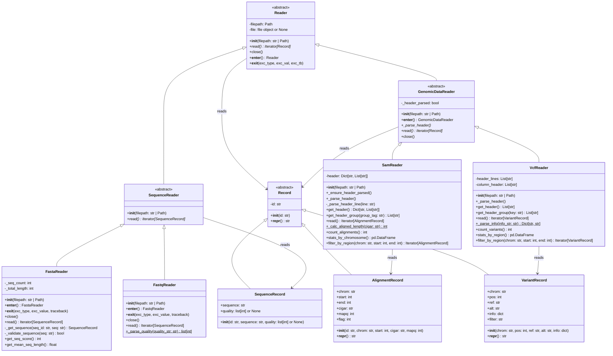

# BioDataReader

Библиотека для чтения и анализа геномных файлов в форматах **FASTA**, **FASTQ**, **SAM** и **VCF**.

## Возможности

- Чтение последовательностей из FASTA/FASTQ
- Парсинг SAM-файлов (выравниваний)
- Анализ VCF-файлов (вариантов)
- Валидация данных и статистика
- Готовые CLI-скрипты для быстрого запуска

## Установка

```bash
# Клонирование репозитория
git clone https://github.com/bioinf-rnrmu-stotoshka/bioformats-bioboba.git
cd bioformats-bioboba
```

## Пример использования
```bash
python biodatareader/run_<формат>.py <входной_файл> [дополнительные_параметры]
```
### Класс FastaReader
```bash
python biodatareader/run_fasta.py GCA_000006945.2_ASM694v2_genomic.fna
```
**Пример вывода**
```text
Количество последовательностей: 2
Средняя длина последовательности: 2475691.50
```
### Класс FastqReader
```bash
python biodatareader/run_fastq.py SRR3280893_1.fastq
```
**Пример вывода**


### Класс SamReader
```bash
python biodatareader/run_sam.py Col0_C1.100k.sam
```
**Пример вывода**
```text
=== Заголовки SAM-файла ===
@SQ:
  SN:1  LN:30427671
  SN:2  LN:19698289
  SN:3  LN:23459830
  SN:4  LN:18585056
  SN:5  LN:26975502
  SN:C  LN:154478
  SN:M  LN:366924

=== Общее количество выравниваний: 34,298

=== Статистика по хромосомам ===
chrom  count
    1  34298
```
### Класс VcfReader
```bash
python biodatareader/run_vcf.py HG00098.vcf
```
**Пример вывода**
```text
======================================================================
1. ЗАГОЛОВКИ VCF-ФАЙЛА
======================================================================
Найдено 22 мета-заголовков (##...)
  ##fileformat=VCFv4.0
  ##filedat=20101112
  ##datarelease=20100804
  ##samples=629
  ##description="Where BI calls are present, genotypes and alleles are from BI.  In there absence, UM genotypes are used.  If neither are available, no genotype information is present and the alleles are from the NCBI calls."
  ... и ещё 17 строк

======================================================================
2. ИНФОРМАЦИЯ ПО ГРУППАМ ЗАГОЛОВКОВ
======================================================================

##INFO — найдено записей: 9
  ##INFO=<ID=DP,Number=1,Type=Integer,Description="Total Depth">
  ##INFO=<ID=CB,Number=.,Type=String,Description="List of centres that called, UM (University of Michigan), BI (Broad Institute), BC (Boston College), NCBI">
    ... и ещё 7

##FILTER — не найдены

##FORMAT — найдено записей: 7
  ##FORMAT=<ID=AD,Number=.,Type=Integer,Description="Allelic depths for the ref and alt alleles in the order listed">
  ##FORMAT=<ID=DP,Number=1,Type=Integer,Description="Read Depth (only filtered reads used for calling)">
    ... и ещё 5

##contig — не найдены

======================================================================
3. КОЛИЧЕСТВО ВАРИАНТОВ
======================================================================
Общее количество вариантов: 46,065

======================================================================
4. СТАТИСТИКА ПО РЕГИОНАМ (ХРОМОСОМАМ)
======================================================================
region  variant_count
    22          46065

Всего регионов (хромосом) с вариантами: 1

Анализ завершён.
```

## Диаграмма классов



## Документация
Полная документация с описанием классов и методов доступна в папке docs/ .
Чтобы собрать локально:

```bash
cd docs
make html # для Windows - ./make html
```


## Вклад в проект
См. CONTRIBUTING.md

## Лицензия

Этот проект распространяется под лицензией MIT.
